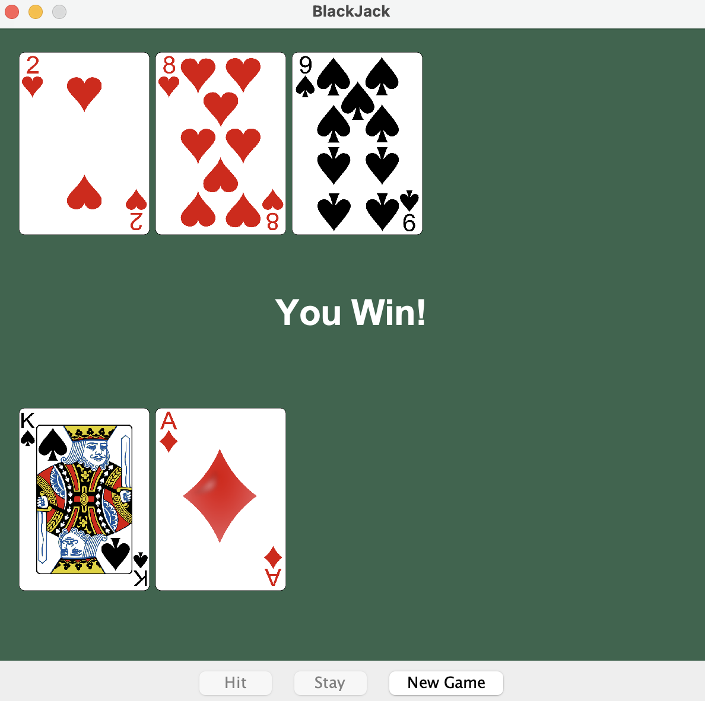

# BlackJack Java

A classic BlackJack card game built with Java Swing. Play against the dealer and try to get as close to 21 as possible without going over!



## Features

- **Classic BlackJack Gameplay** - Standard casino rules with hit, stay, and automatic dealer play
- **Graphical Interface** - Clean, intuitive UI with card images
- **Ace Handling** - Aces automatically adjust between 11 and 1 as needed
- **New Game** - Restart anytime without closing the application
- **Dealer AI** - Dealer follows standard "hit until 17" rule

## Game Rules

1. **Goal**: Get as close to 21 as possible without going over (busting)
2. **Card Values**:
   - Number cards (2-10): Face value
   - Face cards (J, Q, K): 10 points
   - Aces: 11 or 1 (automatically adjusted)
3. **Gameplay**:
   - You and the dealer each start with 2 cards
   - One dealer card is hidden until you stay
   - **Hit**: Draw another card
   - **Stay**: End your turn; dealer reveals and draws
   - Dealer must hit until reaching 17 or higher
4. **Winning**:
   - Closest to 21 without busting wins
   - If you bust, you lose immediately
   - If dealer busts, you win

## Requirements

- Java 11 or higher
- Any IDE (IntelliJ IDEA, VS Code, Eclipse) or command line

## Project Structure

```text
BlackJackJava/
├── src/
│   ├── com/
│   │   └── jasonhunter95/
│   │       └── blackjack/
│   │           ├── App.java        # Application entry point
│   │           ├── BlackJack.java  # Main game logic and UI
│   │           └── Card.java       # Card representation
│   └── cards/                      # Card image assets (53 PNGs)
├── README.md
├── LICENSE
└── .gitignore
```

## How to Run

### Using Command Line

```bash
# Navigate to the project directory
cd BlackJackJava

# Compile the source files
javac -d out src/com/jasonhunter95/blackjack/*.java

# Copy card images to output directory
cp -r cards out/

# Run the application
java -cp out com.jasonhunter95.blackjack.App
```

### Using an IDE

1. Open the project in your preferred IDE
2. Set `src` as the source root
3. Run the `App.java` file

## Technologies Used

- **Java 11+** - Core programming language
- **Swing** - GUI framework for the graphical interface
- **AWT** - Graphics and event handling

## Future Enhancements

- [ ] Betting system with chip management
- [ ] Split and Double Down options
- [ ] Sound effects
- [ ] High score tracking
- [ ] Multiple deck options

## License

This project is licensed under the MIT License - see the [LICENSE](LICENSE) file for details.

## Author

**Jason Hunter** - [GitHub](https://github.com/jasonhunter95)
